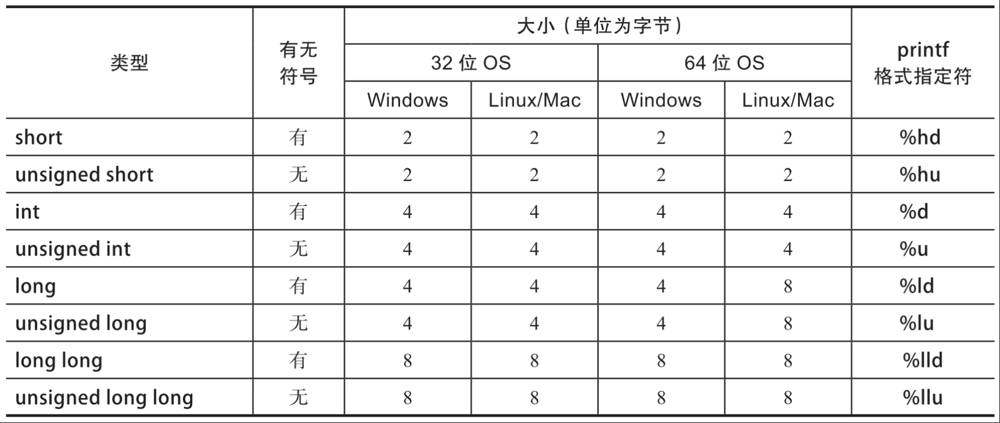

# C++基础语法
---

- [基本类型](#基本类型)
  - [基本类型](#基本类型)
- [资源管理](#资源管理)
  - [堆](#堆)
  - [栈](#栈)
  - [RAII](#raii)
  - [实现C++智能指针](#实现c智能指针)
- [基础概念](#基础概念)
  - [虚函数与纯虚函数](#虚函数与纯虚函数)


---


编译说明：

```shell
# gcc
g++ -std=c++17 -W -Wall -Wfatal-errors 文件名

# Clang
clang++ -std=c++17 -W -Wall -Wfatal-errors 文件名

# MSVC
cl /std:c++17 /EHsc /W3 文件名
```


#### 基本类型

基本类型，又称原始类型或内置类型，是最基本的对象类型，包括整数、浮点数、字符、布尔、byte、size_t和void。

##### 基本类型

整数类型存储的是整数。四种大小的整数类型分别是short int、int、long int和long long int。每个类型都可以是有符号(signed)或无符号(unsigned)的。有符号变量可以是正数、负数或零，无符号变量必须是非负数。

 

> 注意：如果需要确保整数的大小，可以使用`<cstdint>`库中的整数类型，如int8_t、int16_t、int32_t或int64_t。

字面量是程序中的硬编码值。我们可以使用四种硬编码的、整数字面量表示：

> 整数字面量可以包含任何数量的单引号(')，以方便阅读。编译器会完全忽略这些引号。例如，1000000和1'000'000都是表示一百万的字面量。

+ 二进制：使用前缀0b
+ 八进制：使用前缀0
+ 十进制：默认的
+ 十六进制：使用前缀0x

```c++
```


#### 资源管理

##### 堆

堆，heap，在内存管理的语境下，指的是动态分配内存的区域。这里的内存，被分配之后需要手工释放，否则，就会造成内存泄漏。

C++ 标准里一个相关概念是自由存储区，英文是 free store，特指使用 new 和 delete 来分配和释放内存的区域。一般而言，这是堆的一个子集：

+ new 和 delete 操作的区域是 free store
+ malloc 和 free 操作的区域是 heap

但 new 和 delete 通常底层使用 malloc 和 free 来实现，所以 free store 也是 heap。

在堆上动态分配内存，有些语言可能使用new关键字，有些语言则是在对象的构造是隐式分配，不需要关键字，但不管哪种情况，程序通常涉及三个可能的内存管理操作：

1. 让内存管理器分配一个某个大小的内存块

   > 分配内存要考虑程序当前已经有多少未分配的内存。内存不足时要从操作系统申请新的内存。内存充足时，要从可用的内存里取出一块合适大小的内存，做簿记工作将其标记为已用，然后将其返回给要求内存的代码。
   >
   > 注意：如果内存管理器支持垃圾收集的话，分配内存的操作还可能会触发垃圾收集。

2. 让内存管理器释放一个之前分配的内存块

   > 释放内存不只是简单地把内存标记为未使用。对于连续未使用的内存块，通常内存管理器需要将其合并成一块，以便可以满足后续的较大内存分配要求。毕竟，目前的编程模式都要求申请的内存块是连续的。

3. 让内存管理器进行垃圾收集操作，寻找不再使用的内存块并予以释放

C++通常会做上面操作的1和2，java会做上面操作的1和3，而python会做上面操作的1、2、3。


##### 栈

栈，stack，在内存管理的语境下，指的是函数调用过程中产生的本地变量和调用数据的区域。这个栈和数据结构里的栈高度相似，都满足“后进先出”（last-in-first-out 或 LIFO）。

在包括 x86 在内的大部分计算机体系架构中，栈的增长方向是低地址，因而上方意味着低地址。任何一个函数，根据架构的约定，只能使用进入函数时栈指针向上部分的栈空间。当函数调用另外一个函数时，会把参数也压入栈里（我们此处忽略使用寄存器传递参数的情况），然后把下一行汇编指令的地址压入栈，并跳转到新的函数。新的函数进入后，首先做一些必须的保存工作，然后会调整栈指针，**分配出本地变量所需的空间**，随后执行函数中的代码，并在执行完毕之后，根据调用者压入栈的地址，返回到调用者未执行的代码中继续执行。

本地变量所需的内存就在栈上，跟函数执行所需的其他数据在一起。当函数执行完成之后，这些内存也就自然而然释放掉了。

+ 栈上的分配极为简单，移动一下栈指针而已
+ 栈上的释放也极为简单，函数执行结束时移动一下栈指针即可
+ 由于后进先出的执行过程，不可能出现内存碎片

对于某个函数占用的栈空间，叫做栈帧（stack frame），GCC和Clang的命令行参数中提到frame的，如 `-fomit-frame-pointer`，一般指栈帧。

在C++中，POD（Plain Old Data）类型以及有构造和析构函数的非POD类型，在栈上内存分配同样有效，且C++编译器会在生成代码的合适位置，插入对构造和析构函数的调用。编译器会自动调用析构函数，包括在函数执行发生异常的情况。在发生异常时对析构函数的调用，还有一个专门的术语，叫栈展开（stack unwinding）。

```c++
#include <iostream>

using namespace std;

class Obj {
public:
    Obj() { cout << "Obj()" << endl; }

    ~Obj() { cout << "~Obj()" << endl; }
};

void foo(int n) {
    Obj obj;
    if (n == 42)
        throw "life, the universe and everything";
}

int main() {
    try {
        foo(41);
        foo(42);
    }
    catch (const char *s) {
        cout << s << endl;
    }
}
```

执行结果：

```
Obj()
~Obj()
Obj()
~Obj()
life, the universe and everything
```


##### RAII

RAII，完整的英文是 Resource Acquisition Is Initialization，是 C++ 所特有的资源管理方式。有少量其他语言，如 D、Ada 和 Rust 也采纳了 RAII，但主流的编程语言中， C++ 是唯一一个依赖 RAII 来做资源管理的。RAII 依托栈和析构函数，来对所有的资源，包括堆内存在内进行管理。对 RAII 的使用，使得 C++ 不需要类似于 Java 那样的垃圾收集方法，也能有效地对内存进行管理。

C++ 支持将对象存储在栈上面。但是，在很多情况下，对象不能，或不应该，存储在栈上。比如

+ 对象很大
+ 对象的大小在编译时不能确定
+ 对象是函数的返回值，但由于特殊的原因，不应使用对象的值返回

常见情况之一是，在工厂方法或其他面向对象编程的情况下，返回值类型是基类。下面的例子，是对工厂方法的简单演示：

```c++
enum class shape_type {
  circle,
  triangle,
  rectangle,
  …
};
class shape { … };
class circle : public shape { … };
class triangle : public shape { … };
class rectangle : public shape { … };
shape* create_shape(shape_type type)
{
  …
  switch (type) {
  case shape_type::circle:
    return new circle(…);
  case shape_type::triangle:
    return new triangle(…);
  case shape_type::rectangle:
    return new rectangle(…);
  …
  }
}
```

这个 create_shape 方法会返回一个 shape 对象，对象的实际类型是某个 shape 的子类，圆，三角形等。这种情况下，函数的返回值只能是指针或其变体形式。如果返回类型是 shape，实际却返回一个 circle，编译器不会报错，但结果多半是错的。这种现象叫对象切片（object slicing），是 C++ 特有的一种编码错误。这种错误不是语法错误，而是一个对象复制相关的语义错误，也算是 C++ 的一个陷阱了，大家需要小心这个问题。

那么，我们怎样才能确保，在使用 create_shape 的返回值时不会发生内存泄漏呢？

答案就在析构函数和它的栈展开行为上。我们只需要把这个返回值放到一个本地变量里，并确保其析构函数会删除该对象即可。一个简单的实现如下所示：

```c++
class shape_wrapper {
public:
  explicit shape_wrapper(
    shape* ptr = nullptr)
    : ptr_(ptr) {}
  ~shape_wrapper()
  {
    delete ptr_;
  }
  shape* get() const { return ptr_; }
private:
  shape* ptr_;
};
void foo()
{
  …
  shape_wrapper ptr_wrapper(
    create_shape(…));
  …
}
```

在析构函数中执行必要的清理工作，是RAII的基本用法，这种清理不限于释放内存，还能用于如下场景：

+ 关闭文件，如fstream的析构
+ 释放同步锁
+ 释放其他的重要的系统资源

如：

```c++
// 正确的锁使用
std::mutex mtx;
int cnt = 0;

void func() {
    // 开启锁保护
    std::lock_guard<std::mutex> guard(mtx);
    if (!mtx.try_lock()) {
        // 同步代码块
    }
}

// 错误的锁使用
std::mutex mtx;

void func() {
    mtx.lock();
    // 同步代码块
    // 当同步代码块异常时，不会释放锁资源
    mtx.unlock();
}
```


##### 实现C++智能指针

实现简单的智能指针模板类：

```c++
template<typename T>
class custom_smart_ptr {
public:
    explicit custom_smart_ptr(T *ptr) : _ptr(ptr) {}

    virtual ~custom_smart_ptr() {
        delete _ptr;
    }
private:
    T *_ptr;
};
```

重载指针运算符：

```c++
// 运算符重载，定义指针常用的运算符：*、->、bool表达式
T &operator*() const { return *_ptr; }
T *operator->() const { return _ptr; }
explicit operator bool() const { return _ptr; }
```

拷贝与赋值操作：针对模板类的拷贝，有多种方案供考虑

+ 禁止拷贝：可以避免运行时的未定义行为，对同一内存多次释放的问题

  ```c++
  custom_smart_ptr(const custom_smart_ptr &) = delete;
  custom_smart_ptr &operator=(const custom_smart_ptr &) = delete;
  ```

+ 在拷贝对象时转移指针的所有权，c++98写法：

  + 在拷贝构造函数中，通过调用other的release方法来释放它对指针的所有权
  + 在赋值函数中，则通过拷贝构造产生一个临时对象并调用swap来交换对指针的所有权

  ```c++
  custom_smart_ptr(custom_smart_ptr &other) noexcept {
      _ptr = other.release();
  }
  
  custom_smart_ptr &operator=(custom_smart_ptr &rhs) {
      custom_smart_ptr(rhs).swap(*this);
      return *this;
  }
  
  T *release() {
      T *ptr = _ptr;
      _ptr = nullptr;
      return ptr;
  }
  
  void swap(custom_smart_ptr &rhs) {
      using std::swap;
      swap(_ptr, rhs._ptr);
  }
  ```

  注意：上述实现保证了强异常安全性，见 [https://stackoverflow.com/questions/3279543/what-is-the-copy-and-swap-idiom/3279550#3279550](https://stackoverflow.com/questions/3279543/what-is-the-copy-and-swap-idiom/3279550#3279550) ，赋值分为拷贝构造和交换两步，异常只可能在第一步发生；而第一步如果发生异常的话，this 对象完全不受任何影响。无论拷贝构造成功与否，结果只有赋值成功和赋值没有效果两种状态，而不会发生因为赋值破坏了当前对象这种场景。

+ 移动语义：

  + 把拷贝构造函数中的参数类型 custom_smart_ptr& 改成了 custom_smart_ptr&& ，成了移动构造函数
  + 把赋值函数中的参数类型 custom_smart_ptr& 改成了 custom_smart_ptr，在构造参数时直接生成新的智能指针，从而不再需要在函数体中构造临时对象。现在赋值函数的行为是移动还是拷贝，完全依赖于构造参数时走的是移动构造还是拷贝构造

  ```c++
  custom_smart_ptr(custom_smart_ptr &&other) {
      _ptr = other.release();
  }
  
  custom_smart_ptr &operator=(custom_smart_ptr rhs) {
      rhs.swap(*this);
      return *this;
  }
  ```

  根据 C++ 的规则，如果提供了移动构造函数而没有手动提供拷贝构造函数，那后者自动被禁用，这个是C++ 11的unique_ptr的基本行为：

  ```c++
  custom_smart_ptr<hello> ptr(new hello());
  custom_smart_ptr<hello> ptr2{ptr}; // 编译出错
  custom_smart_ptr<hello> ptr3;
  ptr3 = ptr; // 编译出错
  ptr3 = std::move(ptr); // OK
  custom_smart_ptr<hello> ptr4{std::move(ptr3)}; // OK
  ```


#### 基础概念

##### 虚函数与纯虚函数

多态，polymorphism，是面向对象编程语言的一大特点，而C++实现多态的机制是虚函数。其核心概念是通过基类访问派生类定义的函数。多态性使得程序调用的函数是在运行时动态确定的，而不是在编译时静态确定的。使用一个基类类型的指针或者引用，来指向子类对象，进而调用由子类复写的个性化的虚函数，这是C++实现多态性的一个最经典的场景。

```c++
class Test {
public:
    // 虚函数：在类成员方法的声明语句前加virtual（注意，是方法声明，而非方法定义）
    // 覆写Override：子类可以重新定义基类的虚函数
    // 子类如果不提供虚函数的实现，将会自动调用基类的缺省虚函数实现，作为备选方案
    virtual void info();

    // 纯虚函数：在虚函数后面添加 =0
    // 子类必须提供纯虚函数的实现，否则编译失败。即使在基类中提供了纯虚函数的实现，也无法通过指向子类对象的基类类型指针来调用该纯虚函数，即不能作为子类相应纯虚函数的备选方案。
    virtual void addInfo() = 0;
};

// Test类的方法定义
void Test::info()  {
    cout << "father" << endl;
}
```

虚函数实现原理：类对象公用普通函数、虚函数以及虚函数表，当类中至少一个虚函数时，该类对象中会持有一个虚函数表指针vptr（即使有多个虚函数，也会只有一个虚函数表指针）指向虚函数表，而虚函数表vtbl中会存在多个函数指针，分别指向对应的虚函数实现。因此，虚函数实现的过程是：**通过对象内存中的虚函数指针vptr找到虚函数表vtbl，再通过vtbl中的函数指针找到对应虚函数的实现区域并进行调用。**所以虚函数的调用时由指针所指向内存块的具体类型决定的。

> 注意：
>
> + **虚函数只能借助于指针或者引用来达到多态的效果，**当使用类的指针调用成员函数时，普通函数由指针类型决定，而虚函数由指针指向的实际类型决定。
> + 构造函数不能是虚函数：构造函数用于实例化一个对象，即为对象内存中的值作初始化操作，而虚函数的实现是基于对象内存中的vptr实现，在构造函数完成之前，vptr是没有值的，即无法通过vptr找到作为构造函数和虚函数所在的代码区，即构造函数只能以普通函数的形式存放在类指定的代码区中。
> + 析构函数可以是虚函数且推荐最好设置为虚函数：一般而言，子类会有自己的成员，如果析构函数不是虚函数，则调用的将会是基类base的析构函数，无法释放成员。

对象切片（object slicing）：在函数传参处理多态性时，如果一个派生类对象在UpCasting时，用的是传值的方式，而不是指针和引用，那么，这个派生类对象在UpCasting以后，将会被slice成基类对象。

```c++
class Father {
public:
    virtual void info() {
        cout << "father" << endl;
    }
};

class Son : public Father {
public:
    void info() override {
        cout << "son" << endl;
    }
};

int main() {
    Father f1 = Son(); // 栈中内存分配，由操作系统进行内存的分配和管理
    f1.info(); // 输出：father，没有了多态
    Father *f2 = new Son(); // 堆中内存分配，由管理者进行内存的分配和管理，用完必须delete()，否则可能造成内存泄漏
    f2->info(); // 输出：son
    Son s = Son();
    Father &f3 = s;
    f3.info(); // 输出：son
    return 0;
}
```

