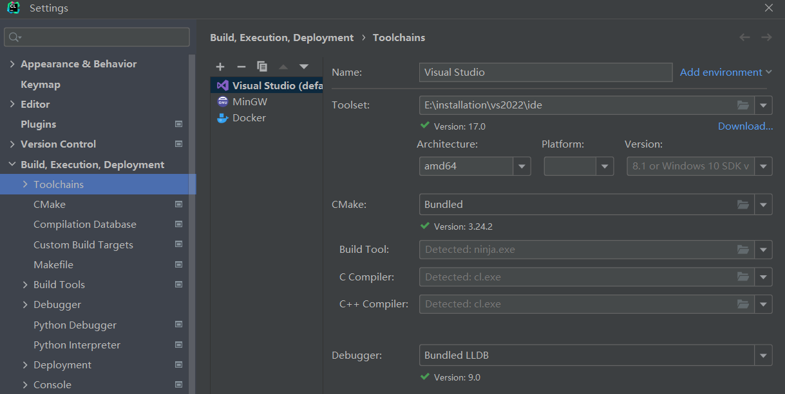
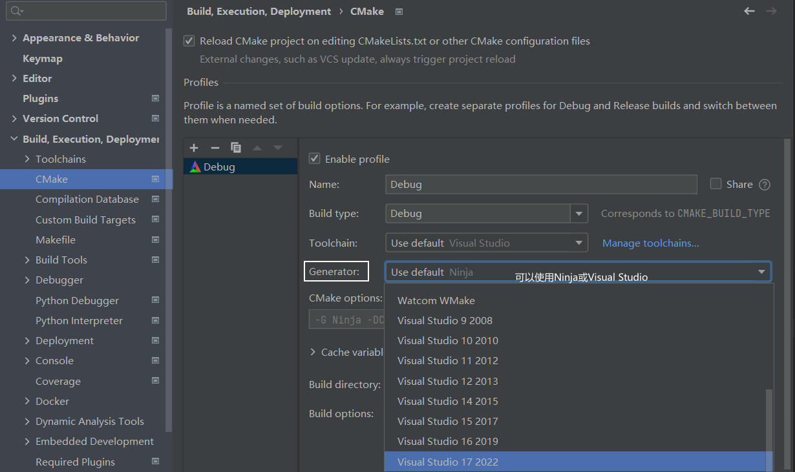
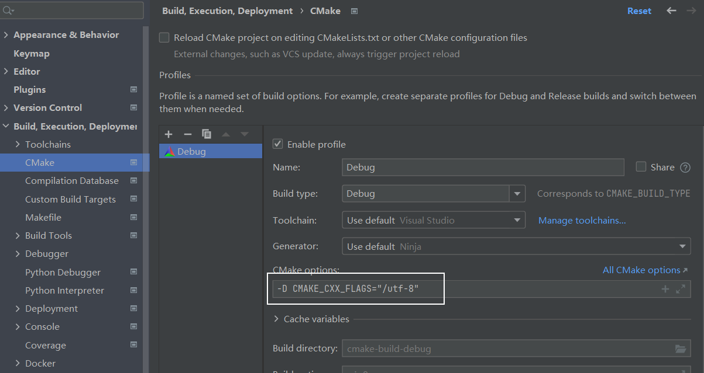
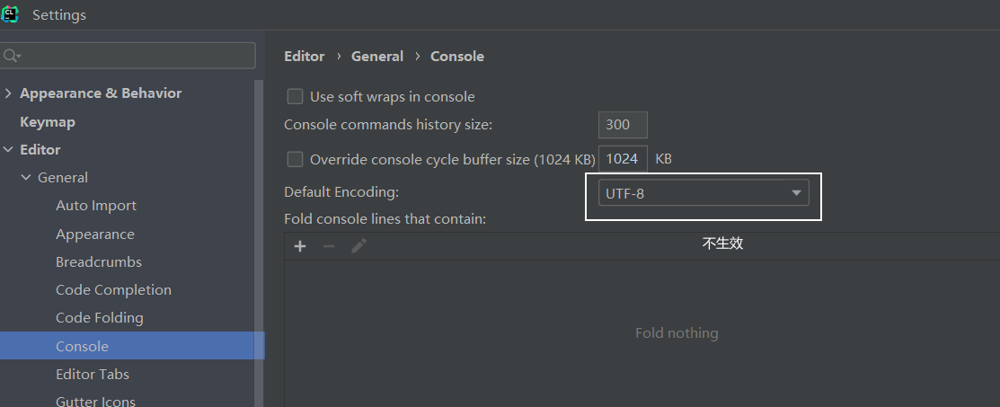
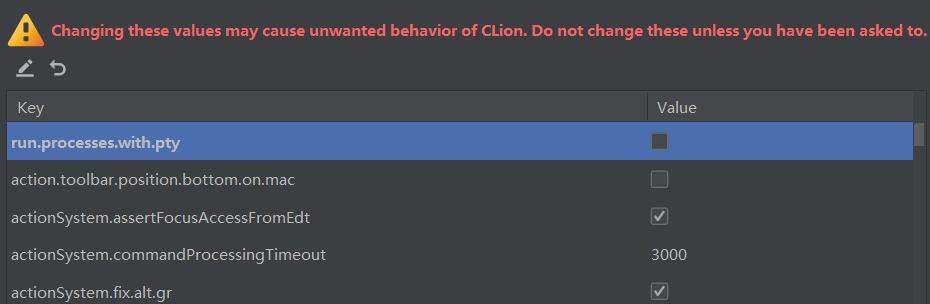
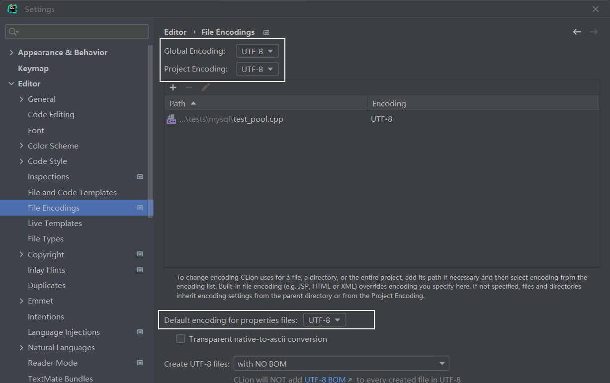
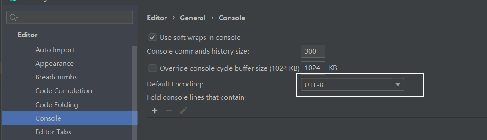

# C++开发环境问题
---

- [Clion 配置 Msvc 编译链](#clion-配置-msvc-编译链)
- [Clion + Msvc 下的字符编码问题](#clion-+-msvc-下的字符编码问题)
- [Clion 控制台中文乱码](#clion-控制台中文乱码)


---


#### Clion 配置 Msvc 编译链

Clion 配置 Msvc 编译链：

1. 配置Toolchains：File -> Settings -> Build, Execution, Deployment -> Toolchains

    

2. 可选：指定Generator

    


#### Clion + Msvc 下的字符编码问题

Clion下调用Visual Studio进行编译，然后就有如下告警，接着就是奇怪的编译失败错误：

```
warning C4819: 该文件包含不能在当前代码页(936)中表示的字符。请将该文件保存为 Unicode 格式以防止数据丢失
```

原因：Clion默认使用UTF-8编码，而MSVC继承了MS家族的一贯传统，除非明确指定要么UTF-8 with BOM，要么当前代码页。

解决方式：加上命令行开关`\utf-8`或者`source-charset:utf-8 /execution-charset:utf-8`，MSVC文档 [https://learn.microsoft.com/en-us/cpp/build/reference/utf-8-set-source-and-executable-character-sets-to-utf-8?view=msvc-170](https://learn.microsoft.com/en-us/cpp/build/reference/utf-8-set-source-and-executable-character-sets-to-utf-8?view=msvc-170)

Clion中设置：

1. 在CMakeList.txt中加入如下内容：[https://cmake.org/cmake/help/latest/manual/cmake-generator-expressions.7.html#manual:cmake-generator-expressions(7)](https://cmake.org/cmake/help/latest/manual/cmake-generator-expressions.7.html#manual:cmake-generator-expressions(7))

   ```cmake
   # 必须位于add_executable()之前
   add_compile_options("$<$<C_COMPILER_ID:MSVC>:/utf-8>")
   add_compile_options("$<$<CXX_COMPILER_ID:MSVC>:/utf-8>")
   ```

2. 使用命令行参数`-D CMAKE_CXX_FLAGS="/utf-8"`，配置方式：File -> Settings -> Build, Execution, Deployment -> CMake

    


#### Clion 控制台中文乱码

Windows控制台代码页的默认编码/字符集是GBK，而Clion的默认编码是utf-8，因此产生乱码。 

解决方式：

1. 修改代码页字符集为utf-8：

   ```c++
   #include <iostream>
   using namespace std;
   
   int main() {
       system("chcp 65001");
       cout << "你好中国" << endl;
       return 0;
   }
   ```

2. 修改Clion的字符集为GBK，不建议

3. 修改Clion控制台字符集设置：File -> Settings -> Editor -> General -> Console

    

   快捷键 Ctrl + Shift + Alt + / 维护面板，选择 1.Registry ，取消勾选 run.processes.with.pty：

    

4. Jetbrains 乱码万能解决方案：

   File -> Editor -> File Encodings，全部设置为 UTF-8：

    

   File -> Editor -> General -> Console，设置为 UTF-8：

    

   Help -> Edit Custom vm options：添加如下两行

   ```
   -Dfile.encoding=UTF-8
   -Dconsole.encoding=UTF-8
   ```

   【仅Clion与Pycharm】快捷键 Ctrl + Shift + Alt + / 维护面板，选择 1.Registry ，取消勾选 run.processes.with.pty：

   
