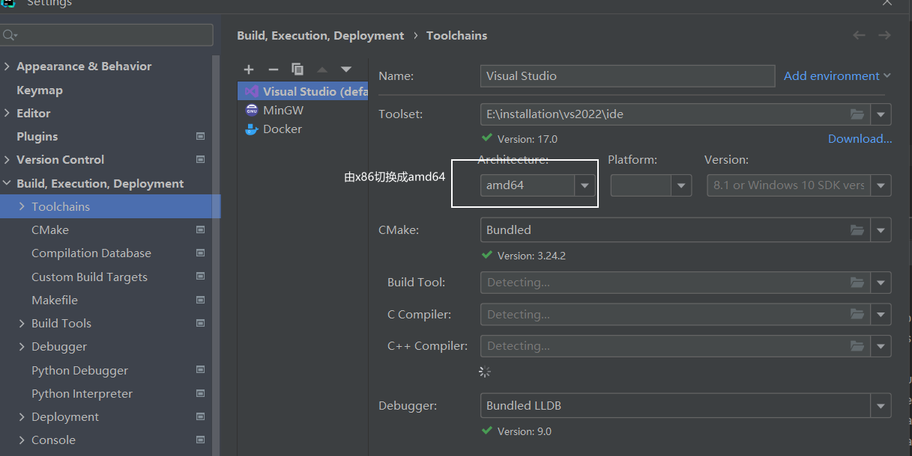
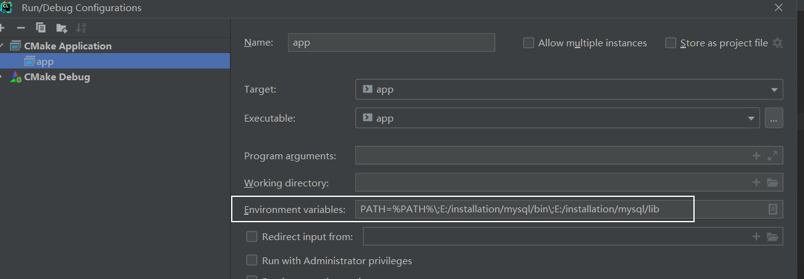

# C++实现MySQL连接池
---

- [编写CMake](#编写cmake)
  - [编译报错 LNK2019](#编译报错-lnk2019)
  - [0xC0000135 报错解决](#0xc0000135-报错解决)
  - [test_mysql.cpp 编译失败问题](#test_mysql.cpp-编译失败问题)
  - [查看exe依赖的dll](#查看exe依赖的dll)


---


MySQL数据库是基于C/S架构进行访问的，除了在服务端使用服务器缓存常用数据，还可以使用连接池来减少每一次创建连接，都会经历的TCP三次握手、MySQL Server连接认证、MySQL Server关闭连接回收资源和TCP四次挥手的性能消耗。

MySQL C++驱动文件：https://downloads.mysql.com/archives/c-c/


#### 编写CMake

cmake引入mysql头文件和动态库：

```cmake
project(app)
set(CMAKE_CXX_STANDARD 17)

# 声明头文件路径
set(INC_DIR "E:/installation/mysql/include")
# 声明动态链接库路径
set(LINK_DIR "E:/installation/mysql/lib/")

# 引入mysql请求头信息
include_directories(${INC_DIR})
# 引入mysql依赖库：libmysql
link_directories(${LINK_DIR})
# 报错0xC0000135：表示找不到dll文件
link_libraries(libmysql)

add_executable(app main.cpp
        src/mysql/Connection.cpp
        src/mysql/Connection.h)
target_link_libraries(app libmysql)
```

编写测试代码：

```c++
#include <iostream>
#include <mysql.h>
#include <string>

using namespace std;

int main() {
    string host = "127.0.0.1";
    unsigned short port = 3306;
    string user = "root";
    string password = "1234";
    string dbname = "train-member";

    MYSQL *mysql_conn = mysql_init(nullptr);
    if (mysql_conn != nullptr) {
        MYSQL *real_conn = mysql_real_connect(mysql_conn, host.c_str(), user.c_str(), password.c_str(),
                                              dbname.c_str(), port, nullptr, 0);
        if (real_conn != nullptr) {
            cout << "connect db success !" << endl;
        }
    }
    mysql_close(mysql_conn);
}
```


##### 编译报错 LNK2019

使用Clion作为编辑器，Visual Studio作为编译器时，编译上述代码时出现如下问题：

 

原因：因为数据库为X86架构的64位扩展（x86_64），其本质为64位，而我们的调试的平台使用的为X86（32位），这就造成了不兼容的问题，需要切换平台设置。

解决方式：

+ Clion IDE：File -> Settings -> Build, Execution, Deployment -> Toolchains

   

+ Visual Studio IDE：

   


##### 0xC0000135 报错解决

执行main函数时报错：0xC0000135，即找不到dll

解决办法：将mysql安装目录下的lib目录以及bin目录添加到PATH环境变量中，或者添加到Clion中添加如下环境变量

 


##### test_mysql.cpp 编译失败问题

现象：编写test_mysql.cpp进行编译，使用MSVC编译一致报错找不到test_mysql.exe，使用mingw能编译通过，其他文件可以正常编译。

原因：test_mysql.cpp 与 mysql 的头文件重名导致问题产生，重命名后问题解决。

注意事项：在使用MSVC时，最好不要和第三方的header文件重名，会导致奇怪的编译问题。


##### 查看exe依赖的dll

在Windows上查看exe文件依赖的dll：

1. 使用Visual Studio提供的dumpbin：

   ```shell
   # 可以通过everything搜索该dumpbin所在位置
   dumpbin.exe /dependents <filename>.exe
   ```

2. 使用lucasg/Dependencies（开源版的现代Dependency Walker）：[https://github.com/lucasg/Dependencies](https://github.com/lucasg/Dependencies)


