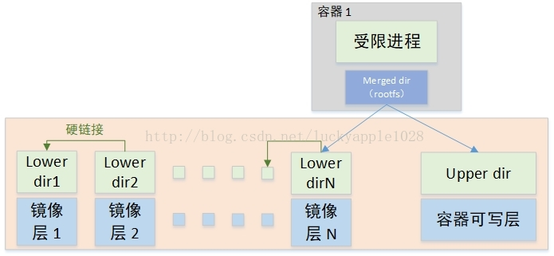
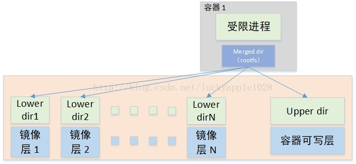

# docker基础
---

  - [基本术语](#基本术语)
- [基本实现原理](#基本实现原理)
  - [命名空间](#命名空间)
  - [Cgroups](#cgroups)
  - [OverlayFS](#overlayfs)
  - [Docker启动模式](#docker启动模式)


---

##### 基本术语

| 名称                     | 解释                                                         |
| ------------------------ | ------------------------------------------------------------ |
| Docker 镜像（Images）    | Docker镜像是用于创建Docker容器的模板                         |
| Docker 容器（Container） | 容器是独立运行的一个或一组应用                               |
| Docker 客户端（Client）  | Docker客户端通过命令行或其他工具使用[Docker API](https://docs.docker.com/engine/api/)与Docker守护进程通信 |
| Docker 主机（Host）      | 一个物理或者虚拟的机器，用于执行Docker守护进程和容器         |

#### 基本实现原理

通过三个方面实现容器化技术：

1. 通过Namespace隔离系统资源技术，隔离网络、PID进程、系统信号量、文件挂载系统、主机名和域名，来实现同一宿主机系统中运行不同的容器，而每个容器之间相互隔离，运行互不干扰
2. 通过系统的Cgroups进行资源限制，限制资源包括CPU、Memory、Blkio（块设备）、Network
3. 通过OverlayFS数据存储技术，实现容器镜像的物理存储与新建容器存储

##### 命名空间

Linux Namespace是Linux系统提供的一种资源隔离机制，可实现系统资源隔离的列表如下：

+ Mount：用于隔离文件系统的挂载点
+ UTS：用于隔离HostName和DomainName
+ IPC：用于隔离进程间通讯
+ PID：用于隔离进程ID
+ Network：用于隔离网络
+ User：用于隔离用户和用户组 UID/GID

查看系统资源隔离：

```shell
# 查看命名空间
ll /proc/`ps aux | grep "ssh" | head -n1 | awk '{print $2}'`/ns/
```


##### Cgroups

Cgroups用于进行资源限制，可以控制的资源如下：

+ Memory：内存限制
+ hugetlb：huge pages使用量
+ cpu：CPU使用率
+ cpuacct：CPU使用率
+ cpuset：绑定cgroups到指定CPUs和NUMA节点
+ innodb_lock_wait_timeout：block设备的IO速度
+ net_cls：网络接口设置优先级
+ devices：mknode访问设备权限
+ freezer：suspend和restore cgroups进程
+ perf_event：性能监控
+ pids：限制子树cgroups总进程数

查看系统实现的资源限制：

```shell
cat /proc/cgroups
```


##### OverlayFS

OverlayFS是一种堆叠文件系统，其依赖并建立于在其他的文件系统之上（如ext4fs和xfs等），并不直接参与在磁盘空间结构的划分，仅仅将原来系统文件中的文件或者目录进行“合并一起”，最后向用户展示“合并”的文件是在同一级的目录，这就是联合挂载技术。与早期AUFS（<1.12版本使用的存储技术）实现相比，OverlayFS速度更快，实现更简单。

OverlayFS通过三个目录实现：

+ lower：支持配置多个，只读
+ upper：单个，支持读写操作
+ work：工作基础目录，挂载后内容会被清空，使用过程中其内容用户不可见

上述三个目录联合挂载完成后给用户呈现的统一视图称为merged目录。

+ lower与upper层中存在同名文件时，lower层的文件会被隐藏，同样，各个lower层已存在相同的层次关系，较上层的屏蔽下层的同名文件；同样，如果是同名目录，则进行合并
+ 用户在merged层中的所有读写操作均在upper层进行，因此，在更新lower层的文件时，会拷贝一份副本到upper层，后续操作均在upper层的拷贝中进行

挂载示例：

```shell
# 创建目录
mkdir -p /test/lower{1..3} /test/upper /test/work /test/merged

# 挂载文件系统
# 当不存在upper层时，整个文件系统只读
mount -t overlay overlay -o lowerdir=/test/lower1:/test/lower2:/test/lower3,upperdir=/test/upper,workdir=/test/work /test/merged

# 查看挂载
mount | grep merged

# 卸载
umount /test/merged
```

Linux内核为Docker提供的OverlayFS驱动有两种，Overlay和Overlay2。Overlay2是相对与Overlay的改进，在Inode利用率上比Overlay更有效。

Overlay Driver挂载方式：本图黄色框中的部分是镜像层和容器层的组织方式，各个镜像层中，每下一层中的文件以硬链接的方式出现在它的上一层中，以此类推，最终挂载overlayfs的lower dir为最上层镜像层目录imager layer N。与此同时，容器的writable dir作为upper dir，挂载成为容器的rootfs

 

Overlay2 Driver挂载方式：Overlay2的挂载方式比Overlay的要简单许多，它基于内核overlayfs的Multiple lower layers特性实现，不在需要硬链接，直接将镜像层的各个目录设置为overlayfs的各个lower layer即可（Overlayfs最多支持500层lower dir），对比Overlay Driver将减少inode的使用。

 


##### Docker启动模式

Docker支持三种启动模式：

```shell
# TCP：-H tcp://0.0.0.0:2375
# sock：-H unix://var/run/docker.sock
# fd：-H fd://socketfd

# 远程镜像查看
docker -H tcp://0.0.0.0:2375 images
```


docker 查看镜像详情：

```shell
# docker查看镜像详情
docker inspect <imageId>

# docker查看存储引擎
docker info | grep -E "Storage Driver|Server Versio"
```


