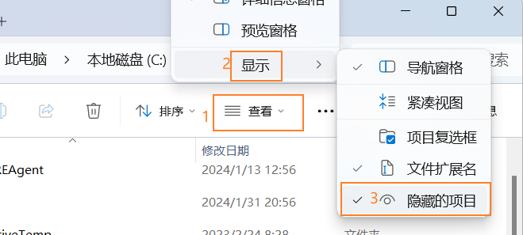

# windows常用操作
---

- [启动文件夹](#启动文件夹)

---

##### 启动文件夹

windows 11启动路径：将软件快捷方式放入启动文件夹可以实现开机自启动

+ 系统级：`C:\ProgramData\Microsoft\Windows\Start Menu\Programs\Startup`

  正常情况下该路径被隐藏，点击菜单栏“查看”，然后选择“显示”，勾选“隐藏的项目”

   

+ 用户级：快捷键 `win + R` 打开运行，输入 `shell:startup`，回车进入用户启动目录。

